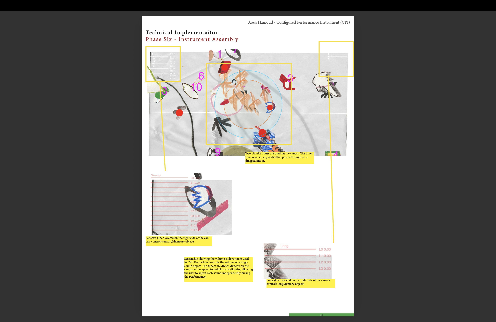

# PROJECT TITLE
Configured Performance Instrument created as an approach to experiemnting with improvised sound art performances. 

## Short Description
Configured Performance Instrument (CPI) is a project that was built upon a set of rules taken from a performance process. Its conceptual task is to find a way to connect between sound and drawing, as well as its relation to chance and improvisation. The instrument consists of nameless independent shapes on screen that have their own memories (sound) floating around and can be encountered by the user. 

## Concept 
The reason for making this project came from past performances I have participated in, both with different artists and individually. In these performances I tend to share my recordings, looking on the use of sound as a research tool, I lay out the tracks on the desktop using QuickTime and play everything at the same time. This listening method allows different layers to appear through coincidence. Then I start changing the volume and embrace chaos through improvisation. 

I took this process and developed it into a tool for improving and expanding my performances. At the same time, drawing has been an ongoing practice for me as a way to reflect on memory. This project became inspiring because it allowed me to connect both practices, bringing sound and drawing together as a single performative tool.

I titled the project Configured Performance Instrument to reflect what I am attempting to build: an instrument rather than a fixed artwork. Using p5.js, I explored a way to integrate my drawings and sounds simultaneously, allowing visual and sonic elements to operate together as a live system.
Configured Performance Instrument recreates my performance logic in a form that is accessible to other users, helping them understand improvisation and the importance of relying on chance.

At its core, the project is time-based, as it incorporates previously recorded situations collected from different times and locations. By reintroducing these recorded sounds into the present moment, the performance creates a window into memory, allowing different memories to intertwine with one another. Each sound carries its own past, and when activated in the present, these fragments meet by chance.

## Technology Used
This project uses p5.js and the p5.sound library to build a time-based, interactive audiovisual instrument. The system is structured around autonomous objects whose behaviors are defined through class-based logic. After simplifying object personalities and reducing inter-object dependencies, the technical focus shifted toward interface design and user interaction.

The user interface is intentionally minimal. Visual elements are not annotated to indicate which audio files they control, preserving ambiguity and avoiding deterministic mapping. This design choice supports improvisation and reflects the unpredictable conditions of live performance.

Interaction is implemented through volume sliders, which allow real-time manipulation of individual sound levels without exposing their identities. In addition, a circular interaction zone is positioned at the center of the canvas. When an object enters this zone, its associated sound is processed using reverb and buffer reversal, introducing spatial and temporal variation into the system.

ChatGPT was used as a technical support tool to assist with debugging, implementing the slider interface, and developing the spatial audio interaction logic. All assisted code sections are commented and referenced within the project for transparency.

## How to Run / Install

CPI can function either as an independent audiovisual installation or as an interactive instrument encountered within an exhibition space.

The user is invited to explore and experiment with the floating shapes moving across the screen. Each shape is paired with an audio recording that plays in a continuous loop. The user’s task is to adjust the volume levels and move selected shapes around the screen in order to discover which sound each object is playing.

Volume sliders control each audio independently
Zones affect audio in diameter 
Audio requires user interaction to start

## Requirements

Web browser on a mac or pc

Javascript 
p5.js library 
p5.sound.js

VS code with live server

headphones or speakers 

## Screenshots / Media

## Credits / Acknowledgements
*Who made it, references.*
##License
*What license is it made under, if any?* 

## Contact / Links
*GitHub repo link, website, demo URL.*
